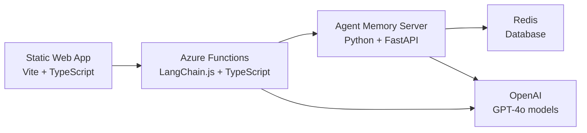

# PodBot - AI Podcast Recommendation Chat

PodBot is a specialized AI chatbot that provides personalized podcast recommendations and discusses all things podcasting. Built with Azure Static Web Apps, Azure Functions, and powered by OpenAI, it maintains conversation context across sessions using Redis Agent Memory Server.

## Quick Start

### Prerequisites

- [Node.js](https://nodejs.org/) (v20)
- [Docker](https://www.docker.com/) (for local Redis and AMS)

### Local Development Setup

1. **Clone this repo**

2. **Install dependencies**:

```bash
npm install
```

3. **Set up environment files**:

```bash
cp .env.example .env
cp web/api/local.settings.example.json web/api/local.settings.json
```

4. **Add your OpenAI API key** to `.env`:

```
OPENAI_API_KEY=your_openai_api_key_here
```

5. **Add your OpenAI API key** to `web/api/local.settings.json` (replace `<your_openai_api_key_here>`)

6. **Start Redis and Agent Memory Server**:

```bash
docker compose up
```

7. **Start the development servers**:

```bash
npm run dev
```

This builds the project and starts both the Azure Functions API and the SWA CLI.

8. **Open your browser** to [http://localhost:4280](http://localhost:4280)

That's it! Enter a username and start chatting with PodBot about podcasts.

## How to Use

1. **Enter a username** and click "Load" to start or resume a conversation
2. **Ask about podcasts** - anything from recommendations to industry discussion
3. **Get AI-powered responses** with personalized suggestions based on your conversation history
4. **Clear your session** anytime to start fresh

## Project Structure

```
podbot-azure/
├── web/                         # Static Web App (frontend + backend)
│   ├── api/                     # Azure Functions (backend)
│   │   ├── src/
│   │   │   ├── functions/       # HTTP function definitions
│   │   │   ├── services/        # Business logic
│   │   │   ├── config.ts        # Configuration
│   │   │   └── main.ts          # Entry point
│   │   ├── host.json
│   │   ├── local.settings.json
│   │   └── package.json
│   ├── src/                     # Frontend application
│   │   ├── main.ts
│   │   ├── api.ts
│   │   ├── types.ts
│   │   └── style.css
│   ├── index.html
│   ├── staticwebapp.config.json
│   └── package.json
├── infra/                       # Azure Bicep templates
├── docker-compose.yaml          # Redis + AMS for local dev
├── azure.yaml                   # Azure Developer CLI config
├── package.json                 # Root workspace
└── .env                         # Environment variables
```

## Architecture

PodBot is built with Azure serverless technologies and containerized dependencies:

### **Web Frontend**

- **[Azure Static Web Apps](https://azure.microsoft.com/en-us/products/app-service/static)** for hosting
- **[Vite](https://vitejs.dev/)** + **[TypeScript](https://www.typescriptlang.org/)** for fast development and type safety
- **[Marked.js](https://marked.js.org/)** for markdown rendering of bot responses
- **[FontAwesome](https://fontawesome.com/)** for modern UI icons

### **API Backend**

- **[Azure Functions](https://azure.microsoft.com/en-us/products/functions)** with v4 programming model
- **[TypeScript](https://www.typescriptlang.org/)** for end-to-end type safety
- **[LangChain](https://js.langchain.com/)** for LLM integration and message handling
- Clean architecture with functions, services, and shared utilities

### **AI & Memory**

- **[OpenAI GPT-4o-mini](https://openai.com/)** (local dev) or **Azure OpenAI** (production) via LangChain for intelligent responses
- **[Redis Agent Memory Server (AMS)](https://github.com/redis/agent-memory-server)** for persistent conversation context
- Smart context window management for efficient token usage

### **Data Storage**

- **[Redis](https://redis.io/)** database for session storage and caching
- **[Docker Compose](https://docs.docker.com/compose/)** for local development dependencies



## Key Features

- **Podcast-Focused AI**: Specialized chatbot that only discusses podcasts and recommendations
- **Persistent Memory**: Conversation history maintained across sessions via AMS
- **Modern UI**: Responsive chat interface with markdown support and loading states
- **Type Safety**: Full-stack TypeScript for reliable development
- **Azure Native**: Built with Azure Static Web Apps and Azure Functions
- **Serverless**: No servers to manage, scales automatically
- **Fast Performance**: Vite for lightning-fast development and optimized builds
- **Local Dev Friendly**: SWA CLI proxies API requests seamlessly

## Development & Testing

### API Testing

Test the Azure Functions backend directly with curl:

```bash
# Send a message
curl -X POST http://localhost:7071/api/sessions/testuser \
  -H "Content-Type: application/json" \
  -d '{"message": "Recommend some true crime podcasts"}'

# Get conversation history
curl -X GET http://localhost:7071/api/sessions/testuser

# Clear conversation
curl -X DELETE http://localhost:7071/api/sessions/testuser
```

## Configuration

### Required Environment Variables

**`.env` (for Docker services):**

- `OPENAI_API_KEY` - Your OpenAI API key ([get one here](https://platform.openai.com/api-keys))

**`web/api/local.settings.json` (for Azure Functions):**

- `OPENAI_API_KEY` - Your OpenAI API key
- `AMS_BASE_URL` - Agent Memory Server URL (default: http://localhost:8000)
- `AMS_CONTEXT_WINDOW_MAX` - Token limit for context window (default: 4000)
- `NODE_ENV` - Environment mode: `dev` (uses OpenAI) or `prod`/`stage` (uses Azure OpenAI)

### Optional Environment Variables (`.env`)

- `AUTH_MODE` - AMS authentication mode (default: disabled)
- `LOG_LEVEL` - AMS logging level (default: DEBUG)

## Local Services

When running locally, the application uses these services:

| Service                 | Port | Description                              |
| ----------------------- | ---- | ---------------------------------------- |
| **SWA CLI**             | 4280 | Static Web App dev server with API proxy |
| **Azure Functions**     | 7071 | Backend API (Azure Functions runtime)    |
| **agent-memory-server** | 8000 | Memory management service (Docker)       |
| **redis**               | 6379 | Database for session storage (Docker)    |

---

_For detailed implementation information, see [CLAUDE.md](./CLAUDE.md)_
